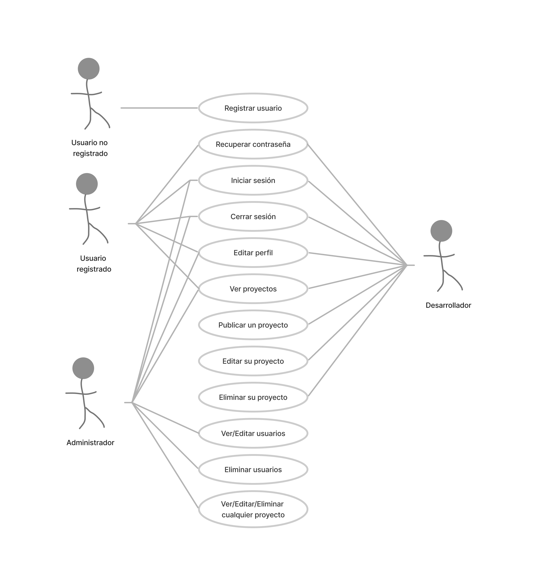

# Definiendo el proyecto 'Vanilla Games'

## Escenario del proyecto

**Vanilla Games S.L.** es una empresa dedicada al desarrollo de minijuegos para navegadores web, utilizando **vanillaJS** (Javascript puro, sin frameworks). 

El equipo está compuesto por 10 desarrolladores y, habitualmente, tres alumnos/as en prácticas, de los cuales al menos uno tiene buenas posibilidades de unirse al equipo al finalizar su formación.

### Metodología de trabajo

Cada miembro del equipo propone un minijuego, el cual se comparte con los demás para su comentario y valoración. Un equipo especializado selecciona las propuestas con mayor potencial para ser desarrolladas y comercializadas.

Hasta ahora, la gestión de propuestas, comentarios y valoraciones se hacía con herramientas ofimáticas. Actualmente, el objetivo es crear una aplicación web tipo intranet para facilitar este proceso.

## Requisitos del proyecto y casos de uso general

Los **casos de uso** describen las interacciones entre el sistema y sus usuarios, ayudando a entender cómo interactúan con la aplicación y qué esperan obtener.

### Casos de uso generales

La aplicación debe permitir que los usuarios:

-**Registro e inicio de sesión**: Los usuarios pueden registrarse con su nombre, apellidos, email y contraseña. Una vez registrados, pueden iniciar y cerrar sesión.
-**Listar proyectos**: Los usuarios registrados pueden ver un listado de proyectos publicados por los desarrolladores.
- **Editar perfil**: Los usuarios pueden editar su perfil y subir una imagen de avatar.

**Para usuarios con perfil de 'desarrollador'**:

-**Publicar proyectos**: Los desarrolladores pueden crear proyectos con información como nombre, descripción, imagen representativa, enlaces al proyecto y repositorio, y el estado del proyecto. También pueden editar o eliminar sus proyectos.
-**Comentarios y valoraciones**: Pueden comentar sobre los proyectos publicados y añadir valoraciones en forma de estrellas.

**Para el administrador**:

-**Gestión de usuarios**: El administrador puede gestionar perfiles de usuarios, modificando o eliminando cuentas y cambiando roles.
- **Control de comentarios**: Tiene control total sobre los comentarios y valoraciones.

# Casos de Uso para la V1.0 - Definición Básica

## 1. Registrar Usuario
Un usuario puede registrarse en la plataforma proporcionando su **nombre**, **apellidos**, **email** y **contraseña**.

## 2. Recuperar Contraseña
Un usuario registrado puede solicitar la recuperación de su contraseña en caso de que la haya olvidado. Para ello, se le enviará un **correo electrónico** con las instrucciones para restablecer su contraseña.

## 3. Iniciar Sesión
Un usuario registrado puede iniciar sesión en la plataforma proporcionando su **email** y **contraseña**.

## 4. Cerrar Sesión
Un usuario puede cerrar su sesión en la plataforma en cualquier momento.

## 5. Editar Perfil
Un usuario registrado puede editar su perfil, actualizando su **nombre**, **apellidos**, **email** o **contraseña**.

## 6. Ver Proyectos
Un usuario registrado puede ver un listado de **proyectos** publicados por los desarrolladores.

## 7. Publicar Proyecto
Un usuario con el perfil de **desarrollador** puede publicar un proyecto proporcionando información como:
- **Nombre** del proyecto
- **Descripción**
- **Imagen representativa**
- **Enlaces** a servidor de pruebas y repositorio de código
- **Estado** del proyecto

## 8. Editar Proyecto
Un usuario con el perfil de **desarrollador** puede editar un proyecto que haya publicado previamente, actualizando la información del proyecto.

## 9. Eliminar Proyecto
Un usuario con el perfil de **desarrollador** puede eliminar un proyecto que haya publicado previamente.

## 10. Ver/Editar Usuarios
Un **administrador** puede ver una tabla con todos los usuarios registrados y editar la información, incluido el **rol** de usuario.

## 11. Eliminar Usuario
Un **administrador** puede eliminar cualquier usuario registrado en la plataforma.

;

## Documentación: Casos de uso especificos #3

# Casos de uso específicos y diagramas de flujo

## Requisitos y diagrama de casos de uso

En esta versión 1.0, hemos definido los casos de uso generales para cada actor y los hemos representado en un diagrama de casos de uso. Ahora, detallaremos los procesos específicos para cada tarea, incluyendo posibles errores del usuario o del sistema.

---

## Casos de uso específicos

### 1. Registrar usuario
**Actores:** Usuario no registrado.

**Precondiciones:** El usuario no ha iniciado sesión.

**Flujo básico:**
1. El usuario navega a la página de registro.
2. El usuario introduce su nombre, apellidos, email y contraseña.
3. El sistema valida que los campos estén completos y que el email no esté registrado previamente.
4. El sistema crea un nuevo usuario con los datos proporcionados.
5. El sistema muestra un mensaje de confirmación y redirige al usuario a la página de inicio.

**Flujos alternativos:**
- 3a. El sistema detecta que el email ya está registrado: muestra un mensaje de error y no crea la cuenta.

---

### 2. Recuperar contraseña
**Actores:** Usuario registrado.

**Precondiciones:** El usuario no ha iniciado sesión.

**Flujo básico:**
1. El usuario navega a la página de recuperación de contraseña.
2. El usuario selecciona la opción 'Recuperar contraseña'.
3. El sistema valida que el campo 'email' esté completo y que el email esté registrado previamente.
4. El sistema muestra un mensaje de confirmación de envío del email para la recuperación de contraseña y redirige al usuario a la página de inicio.

**Flujos alternativos:**
- 3a. El sistema detecta que el email no está registrado: muestra un mensaje de error y no envía el email.

---

### 3. Iniciar sesión
**Actores:** Usuario registrado.

**Precondiciones:** El usuario no ha iniciado sesión.

**Flujo básico:**
1. El usuario navega a la página de inicio de sesión.
2. El usuario introduce su email y contraseña.
3. El sistema valida las credenciales y crea una sesión para el usuario.
4. El sistema redirige al usuario a la página principal de la aplicación.

**Flujos alternativos:**
- 3a. Las credenciales son incorrectas: el sistema muestra un mensaje de error y no crea la sesión.

---

### 4. Cerrar sesión
**Actores:** Usuario registrado.

**Precondiciones:** El usuario ha iniciado sesión.

**Flujo básico:**
1. El usuario hace clic en el botón de "cerrar sesión".
2. El sistema cierra la sesión del usuario.
3. El sistema redirige al usuario a la página de inicio.

---

### 5. Ver/Editar perfil
**Actores:** Usuario registrado.

**Precondiciones:** El usuario ha iniciado sesión.

**Flujo básico:**
1. El usuario navega a la página de edición de perfil.
2. El usuario edita su nombre, apellidos y contraseña.
3. El sistema valida los campos y actualiza el perfil del usuario.
4. El sistema muestra un mensaje de confirmación.

**Flujos alternativos:**
- 3a. El usuario intenta cambiar su email: el sistema valida que el email no esté registrado previamente.

---

### 6. Ver proyectos
**Actores:** Usuario registrado.

**Precondiciones:** El usuario ha iniciado sesión.

**Flujo básico:**
1. El usuario navega a la página de proyectos.
2. El sistema muestra una lista de proyectos publicados por desarrolladores.
3. El usuario puede hacer clic en un proyecto para ver más detalles.
4. El usuario puede mostrar/filtrar los proyectos a partir de un buscador.

---

### 7. Publicar proyecto
**Actores:** Usuario registrado con perfil de desarrollador.

**Precondiciones:** El usuario ha iniciado sesión y su perfil es de desarrollador.

**Flujo básico:**
1. El usuario navega a la página de publicación de proyecto.
2. El usuario introduce el nombre, descripción, imagen representativa, enlaces de servidor y repositorio, estado y otra información relevante del proyecto.
3. El sistema valida los campos y crea un nuevo proyecto.
4. El sistema muestra un mensaje de confirmación y redirige al usuario a la página de proyectos.

**Flujos alternativos:**
- 2a. El desarrollador decide no publicar el proyecto y selecciona la opción de cancelar: el sistema descarta la información ingresada y muestra un mensaje de confirmación.

---

### 8. Editar proyecto
**Actores:** Desarrollador.

**Precondiciones:** El usuario debe haber iniciado sesión como desarrollador y tener al menos un proyecto previamente creado.

**Flujo principal:**
1. El usuario selecciona la opción de "Editar proyecto".
2. El sistema muestra la lista de proyectos previamente creados por el usuario.
3. El usuario selecciona el proyecto que desea editar.
4. El sistema muestra el formulario de edición del proyecto con la información actual.
5. El usuario realiza los cambios necesarios y guarda.
6. El sistema valida la información ingresada y actualiza el proyecto en la base de datos.
7. El sistema muestra una confirmación de que la información del proyecto ha sido actualizada correctamente.

---

### 9. Eliminar proyecto
**Actores:** Desarrollador.

**Precondiciones:** El usuario debe haber iniciado sesión como desarrollador y tener al menos un proyecto previamente creado.

**Flujo principal:**
1. El usuario selecciona la opción de "Eliminar proyecto".
2. El sistema muestra una confirmación de que el usuario está seguro de eliminar el proyecto.
3. El usuario confirma que desea eliminar el proyecto.
4. El sistema elimina el proyecto de la base de datos y muestra una confirmación.

---

### 10. Ver/Editar usuario
**Actores:** Usuario administrador.

**Precondiciones:** El usuario debe haber iniciado sesión en la aplicación y tener rol administrador.

**Flujo principal:**
1. El usuario selecciona la opción de "Ver usuarios".
2. El sistema muestra una tabla con los datos de los usuarios.
3. El administrador realiza cambios en la información de los usuarios y guarda.
4. El sistema valida la información y actualiza los datos en la base de datos.
5. El sistema muestra una confirmación de que la información ha sido actualizada correctamente.

---

### 11. Eliminar usuario
**Actores:** Usuario administrador.

**Precondiciones:** El usuario debe haber iniciado sesión en la aplicación y tener rol administrador.

**Flujo principal:**
1. El usuario selecciona la opción de "Ver usuarios".
2. El sistema muestra una tabla con los datos de los usuarios.
3. El administrador hace clic sobre el icono de eliminar usuario de la fila correspondiente.
4. El sistema informa de que se eliminarán todos sus registros.
5. El sistema muestra una confirmación de que el usuario ha sido borrado correctamente.

---

## Errores

### Posibles errores a considerar:

1. **Error de conexión:** 
   - Mensaje: "No se pudo conectar con la base de datos. Por favor, inténtelo de nuevo o contacte con soporte técnico."

2. **Error de validación:** 
   - Mensaje: "El campo de correo electrónico debe ser una dirección de correo válida."

3. **Error de autenticación:** 
   - Mensaje: "La acción no está autorizada. Por favor, inicie sesión o recupere su contraseña."

4. **Error de autorización:** 
   - Mensaje: "No tiene permisos para realizar esta acción."

5. **Error de servidor:** 
   - Mensaje: "Se ha producido un error. Por favor, inténtelo de nuevo o contacte con soporte técnico."

